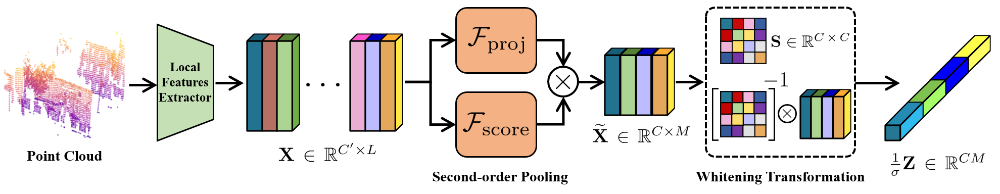

# Voronoi-based Second-order Descriptor with Whitened Metric in LiDAR Place Recognition [ICRA 2026]


## About
This repository contains the official implementation of *Voronoi-based Second-order Descriptor with Whitened Metric in LiDAR Place Recognition* (in press ICRA 2026) and reproducible experiments from the corresponding paper. [arXiv](https://arxiv.org/abs/2603.14974)

## Dependencies
This implementation is tested with following dependencies in Ubuntu 18.04, Python 3.8, and `cudatoolkit=11.6.0`.
* PyTorch==1.13.1
* MinkowskiEngine==0.5.4  // Refer to [MinkowskiEngine installation guide](https://github.com/NVIDIA/MinkowskiEngine?tab=readme-ov-file#cuda-11x)
* pytorch-metric-learning==2.8.1
* pandas==1.5.3
* wandb

We recommend building conda environment and pytorch installation before compiling MinkowskiEngine.
Make sure to exactly match `cudatoolkit` package version identical to the cuda dependency of pytorch;
otherwise MinkowskiEngine library would not be compiled.
You can verify the cuda compiler version with `nvcc -V` command.

## Dataset Configuration

### Oxford
Refer to [jac99/MinkLoc3Dv2](https://github.com/jac99/MinkLoc3Dv2?tab=readme-ov-file#datasets) for downloading the dataset.
```bash
# Generate training tuples by baseline protocol
python datasets/pointnetvlad/generate_training_tuples_baseline.py --dataset_root <oxford_root_path>

# Generate evaluation tuples
python datasets/pointnetvlad/generate_test_sets.py --dataset_root <oxford_root_path>
```

After the tuple generation, the dataset directory should look like follows:
```
<oxford_root_path>
├── readme.txt
├── oxford/
|   └── ...
├── inhouse_datasets/
|   └── ...
├── training_queries_baseline_v2.pickle
├── test_queries_baseline_v2.pickle
├── oxford_evaluation_database.pickle
├── oxford_evaluation_query.pickle
├── university_evaluation_database.pickle
├── university_evaluation_query.pickle
├── residential_evaluation_database.pickle
├── residential_evaluation_query.pickle
├── business_evaluation_database.pickle
└── business_evaluation_query.pickle
```

### Wild-Places
Refer to [csiro-robotics/Wild-Places](https://github.com/csiro-robotics/Wild-Places) for downloading the dataset.
```bash
# We already set the default positive threshold as 3m.
# Set --pos_thresh argument to configure the positive threshold distance.

# Generate training tuples
python datasets/wildplaces/training_sets.py --dataset_root <wildplaces_root_path> --save_folder <wildplaces_root_path>

# Generate evaluation tuples
python datasets/wildplaces/testing_sets.py --dataset_root <wildplaces_root_path> --save_folder <wildplaces_root_path>
```

After the tuple generation, the dataset directory should look like follows:
```
<wildplaces_root_path>
├── Karawatha/
|   └── ...
├── Venman/
|   └── ...
├── K-01.pickle
├── K-02.pickle
├── K-03.pickle
├── K-04.pickle
├── V-01.pickle
├── V-02.pickle
├── V-03.pickle
├── V-04.pickle
├── Karawatha_evaluation_database.pickle
├── Karawatha_evaluation_query.pickle
├── Venman_evaluation_database.pickle
├── Venman_evaluation_query.pickle
├── training_wild-places.pickle
└── testing_wild-places.picklee
```

## How to Use
### Training
```bash
# Train the model with C=16, M=16 in the Oxford benchmark
python training/train.py --config config/config_baseline_v2_cos_400-epochs.txt --model_config model_config/voronoi_v2_C-16_M-16.txt

# Train the model with C=128, M=64 in the Oxford benchmark
python training/train.py --config config/config_baseline_v2_cos.txt --model_config model_config/voronoi_v2_C-128_M-64.txt


# Train the model with C=16, M=16 in the Wild-Places benchmark
python training/train.py --config config/config_wildplaces.txt --model_config model_config/voronoi_wp_C-16_M-16.txt

# Train the model with C=32, M=32 in the Wild-Places benchmark
python training/train.py --config config/config_wildplaces.txt --model_config model_config/voronoi_wp_C-32_M-32.txt

# Train the model with C=128, M=64 in the Wild-Places benchmark
python training/train.py --config config/config_wildplaces.txt --model_config model_config/voronoi_wp_C-128_M-64.txt
```

### Evaluation
```bash
# Reproduce the evluation of C=16, M=16 model in the Oxford benchmark
python eval/pnv_evaluate.py --config config/config_baseline_v2_cos_400-epochs.txt --model_config model_config/voronoi_v2_C-16_M-16.txt --weights weights/RBLW_v2_baseline_sqrt_C-16_M-16_400-epochs.pth

# Reproduce the evluation of C=128, M=64 model in the Oxford benchmark
python eval/pnv_evaluate.py --config config/config_baseline_v2_cos.txt --model_config model_config/voronoi_v2_C-128_M-64.txt --weights weights/RBLW_v2_baseline_sqrt_C-128_M-64.pth


# Reproduce the evluation of C=16, M=16 model in the Wild-Places benchmark
python eval/intra_seq_evaluate.py --config config/config_wildplaces.txt --model_config model_config/voronoi_wp_C-16_M-16.txt --weights weights/RBLW_v2_wp_C-16_M-16.pth # Intra-sequence
python eval/pnv_evaluate.py --config config/config_wildplaces.txt --model_config model_config/voronoi_wp_C-16_M-16.txt --weights weights/RBLW_v2_wp_C-16_M-16.pth       # Inter-sequence

# Reproduce the evluation of C=32, M=32 model in the Wild-Places benchmark
python eval/intra_seq_evaluate.py  --config config/config_wildplaces.txt --model_config model_config/voronoi_wp_C-32_M-32.txt --weights weights/RBLW_v2_wp_C-32_M-32.pt
python eval/pnv_evaluate.py  --config config/config_wildplaces.txt --model_config model_config/voronoi_wp_C-32_M-32.txt --weights weights/RBLW_v2_wp_C-32_M-32.pth

# Reproduce the evluation of C=128, M=64 model in the Wild-Places benchmark
python eval/intra_seq_evaluate.py --config config/config_wildplaces.txt --model_config model_config/voronoi_wp_C-128_M-64.txt --weights weights/RBLW_v2_wp_C-128_M-64.pth
python eval/pnv_evaluate.py --config config/config_wildplaces.txt --model_config model_config/voronoi_wp_C-128_M-64.txt --weights weights/RBLW_v2_wp_C-128_M-64.pth
```

## Acknowledgements
This implementation is based on [jac99/MinkLoc3Dv2](https://github.com/jac99/MinkLoc3Dv2), [cvlab-epfl/Power-Iteration-SVD](https://github.com/cvlab-epfl/Power-Iteration-SVD), [csiro-robotics/Wild-Places](https://github.com/csiro-robotics/Wild-Places), and [shenyanqing1105/ForestLPR-CVPR2025](https://github.com/shenyanqing1105/ForestLPR-CVPR2025).

## Citation

```
@misc{kim2026voronoi,
      title={Voronoi-based Second-order Descriptor with Whitened Metric in LiDAR Place Recognition}, 
      author={Jaein Kim and Hee Bin Yoo and Dong-Sig Han and Byoung-Tak Zhang},
      year={2026},
      eprint={2603.14974},
      archivePrefix={arXiv},
      primaryClass={cs.CV},
      url={https://arxiv.org/abs/2603.14974}, 
}
```
